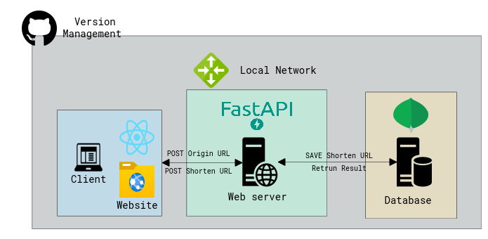

# URLshortner
URL shortener project for SMILEGATE DEV CAMP

# [Architecture](./docs/00_Architecture/README.md)

The above architecture is a first prototype architecture of my URL shortener project.   

# [How to]((./docs/02_Howto/README.md))
## How to install
[windows]   
1. **install dependencies**
    1. install `python` >= v3.10
    2. install `node.js` >= v8.15.0
    3. install `mongodb` >= 6.0   
    4. install `requirements.txt` for backend server   
        here is the command   
        `(workingdirectory)\backend~$ pip install -r requirements.txt`
    5. install `package.json` for frontend   
        here is the command   
        `(workingdirectory)\frontend~$ npm install`
2. **set config**   
    You can modify config options like mongodb host, port, etc. or hashing algorithm.   
    In `(workingdirectory)\backend\src\config\`, you create `config.ini` and set your own. (default options are described in [README.md](../../backend/src/config/README.md) at the directory)

## How to start
[windows]   
1. Open database server
2. Start webserver   
    here is the command   
    `(workingdirectory)\backend~$ python main.py`
3. Start frontend server   
    here is the command   
    `(workingdirectory)\frontend~$ npm start`

## Appendix
### [Features](./docs/01_Features/README.md)
### [API](./docs/03_API/README.md)