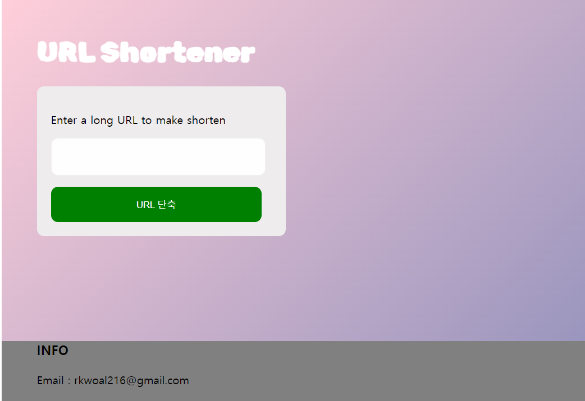
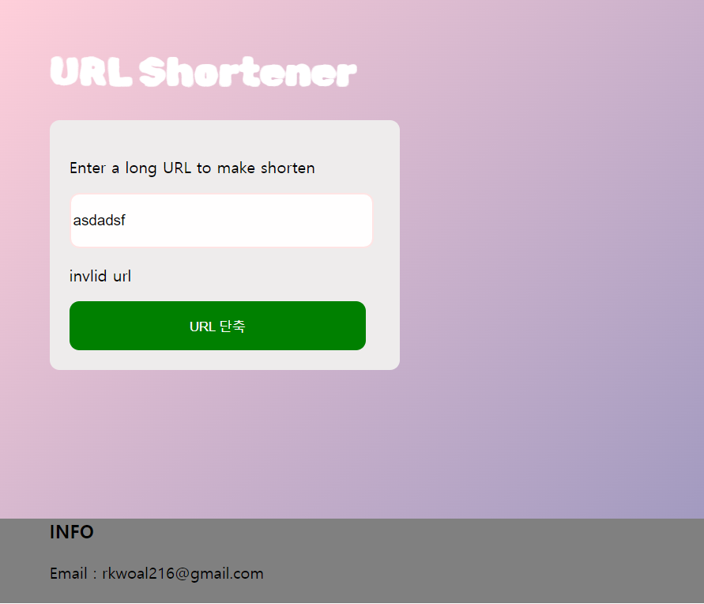
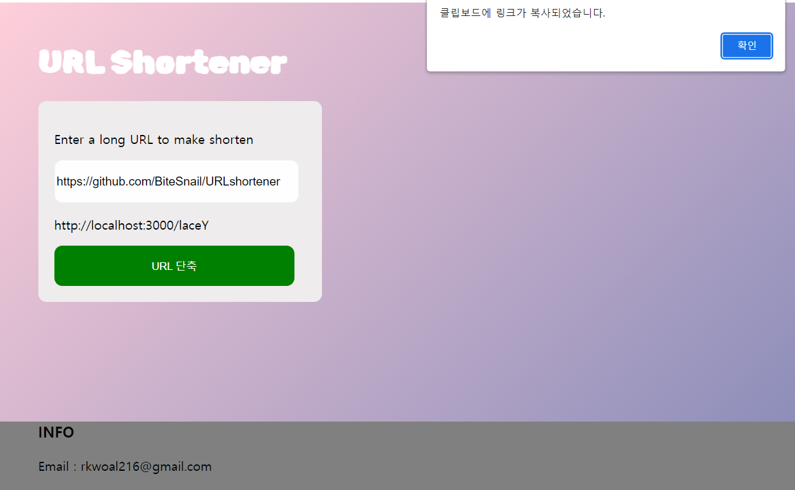

# URLshortner
URL shortener project for SMILEGATE DEV CAMP

# [Architecture](./docs/00_Architecture/README.md)

The above architecture is a first prototype architecture of my URL shortener project.   

# [How to]((./docs/02_Howto/README.md))
## How to install
[windows]   
1. **install dependencies**
    1. install `python` >= v3.10
    2. install `node.js` >= v8.15.0
    3. install `mongodb` >= 6.0   
    4. install `requirements.txt` for backend server   
        here is the command   
        `(workingdirectory)\backend~$ pip install -r requirements.txt`
    5. install `package.json` for frontend   
        here is the command   
        `(workingdirectory)\frontend~$ npm install`
2. **set config**   
    You can modify config options like mongodb host, port, etc. or hashing algorithm.   
    In `(workingdirectory)\backend\src\config\`, you create `config.ini` and set your own. (default options are described in [README.md](../../backend/src/config/README.md) at the directory)

## How to start
[windows]   
1. Open database server
2. Start webserver   
    here is the command   
    `(workingdirectory)\backend~$ python main.py`
3. Start frontend server   
    here is the command   
    `(workingdirectory)\frontend~$ npm start`

## Appendix
### [Features](./docs/01_Features/README.md)
### [API](./docs/03_API/README.md)
---
### 개발 현황 및 목표
#### 개발 현황

1. 메인 페이지
2. 잘못된 url 체크
3. 짧아진 url 흭득 및 클립보드 복사

#### 향후 목표
1. 회원가입 및 로그인 구현
2. 통계 제공(대쉬보드 및 히스토리) 구현

---
안녕하세요. 스마일게이트의 윈터 데브캠프를 통해 처음으로 웹 개발을 시작하게 되었습니다. 결과물은 완전 허접하지만 최대한 강의에서 들었던 대로 폴더 구성도 나누고 문서화도 열심히 해보았습니다.   
이런 말을 주저리주저리 하는 이유는 해당 결과물에 대한 변명이 아니라, 제 수준을 솔직히 말씀드리는 것이 좀 더 구체적인 피드백을 받을 수 있을 것이라고 생각하기 때문입니다.   
아래는 이 프로젝트를 진행하면서 좀 더 구체적으로 피드백 받고 싶은 부분입니다. 
1. 지금은 NoSQL 방식의 mongoDB를 사용하고 있는데, 추후 회원가입 및 로그인 기능을 추가하려면 일반저인 RDBMS를 사용하는 것이 좋나요? 아니면 두 데이터베이스 시스템을 다 사용해도 괜찮나요?
2. 현재 front와 back 사이에서 get, post 방식으로 데이터를 주고받고 있는데 이 데이터를 암호화하는 과정이 필요한가요?
3. 위에 기술한 추가 기능 이외에 현재 시스템에서 필요한 것이 무엇인지 여쭤보고 싶습니다.

제가 모르는 것이 너무 많고 질문의 수준도 너무 낮을 것 같아서 자꾸 혼자서만 찾아보게 되네요. 이번 캠프가 끝날 때 까지 한명의 개발자로 발전할 수 있도록 더욱 노력하겠습니다.    
읽어주셔서 감사합니다. 