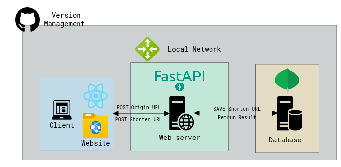

## Architecture

The above architecture is a first prototype architecture of my URL shortener project.   

### Front-End
Use `React` to represent web site. And use `axios` libarary that make communcate to web server by promise API.

### Back-End
Back-End web server is constructed by `FastAPI`. And use `MongoDB` to make NoSQL database because of scalability.